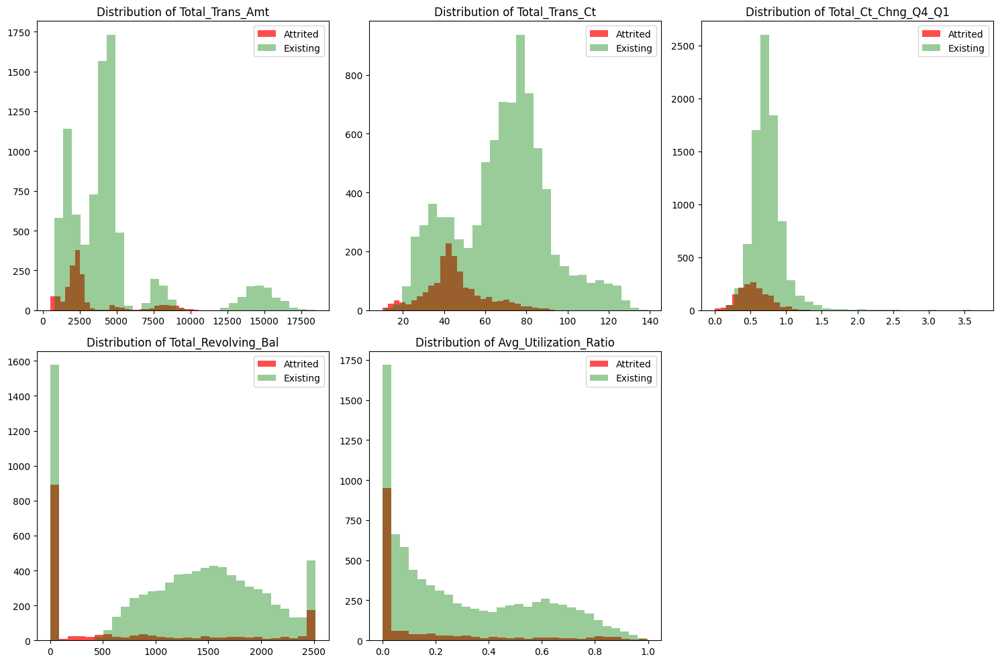
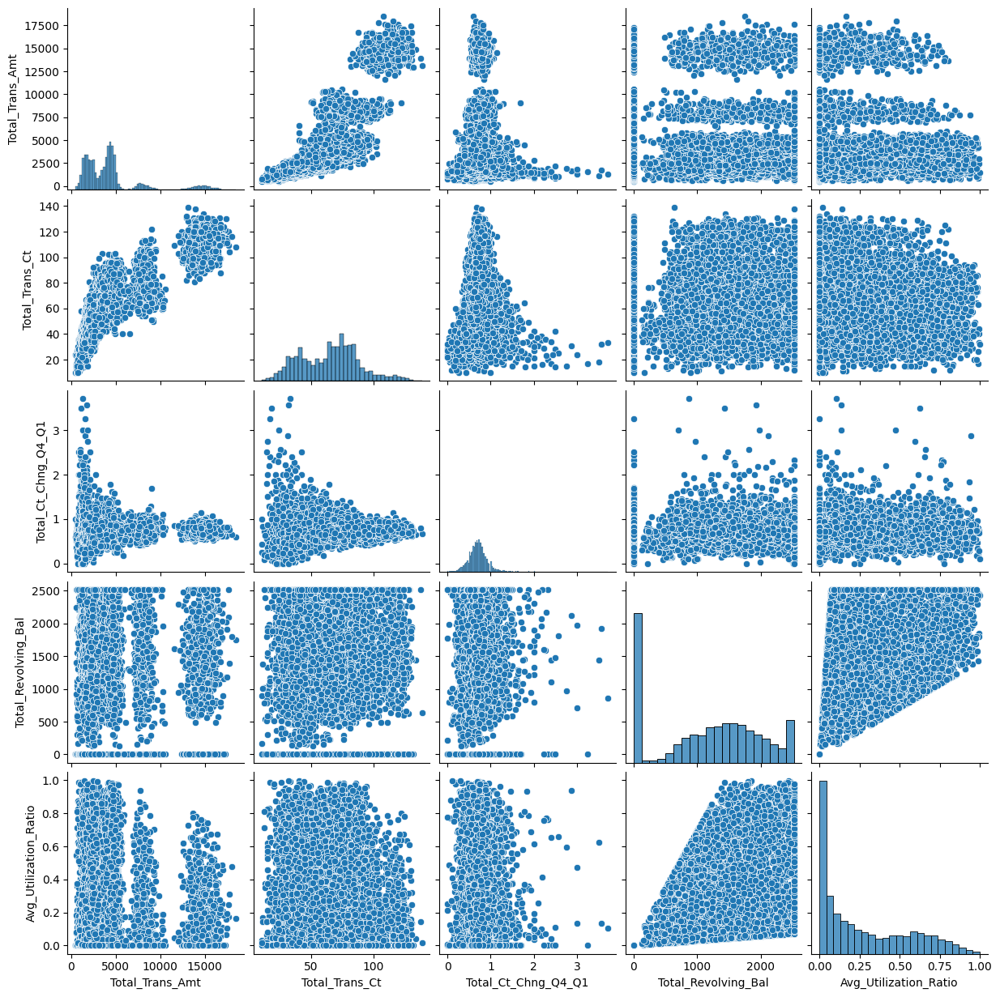
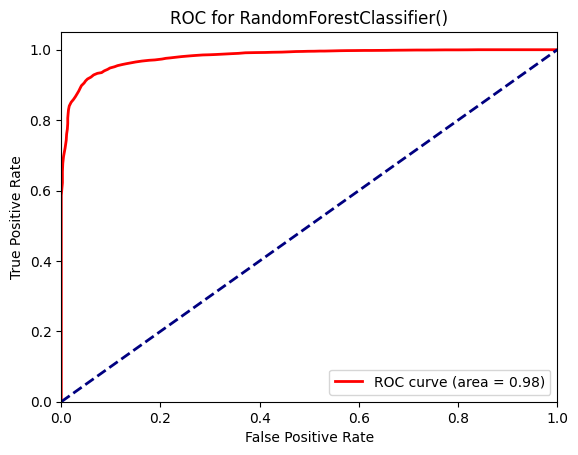
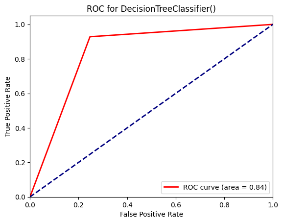

# Credit Card Churn

## Project Overview

This project focuses on predicting client churn for a financial institution concerned with increasing client retention among credit card holders.  The objective is to analyze clients with more propensity to close their bank accoun, find possible groups of clients and define their characteristics and identify clusters of clients for targeted marketing strategies.

## 🛎️ Usage
To run this project, you will need to install several Python libraries. It is recommended to use a virtual environment.
To run the analysis and view the churn prediction models, execute the script on notebooks:

## Visuals

## Timeline

This project was completed in 5 days.

## 📌 Personal Situation
This project was done as part of the AI Boocamp at BeCode.org. 

Connect with me on [LinkedIn](https://www.linkedin.com/in/soha-mohamad-382b44219/).