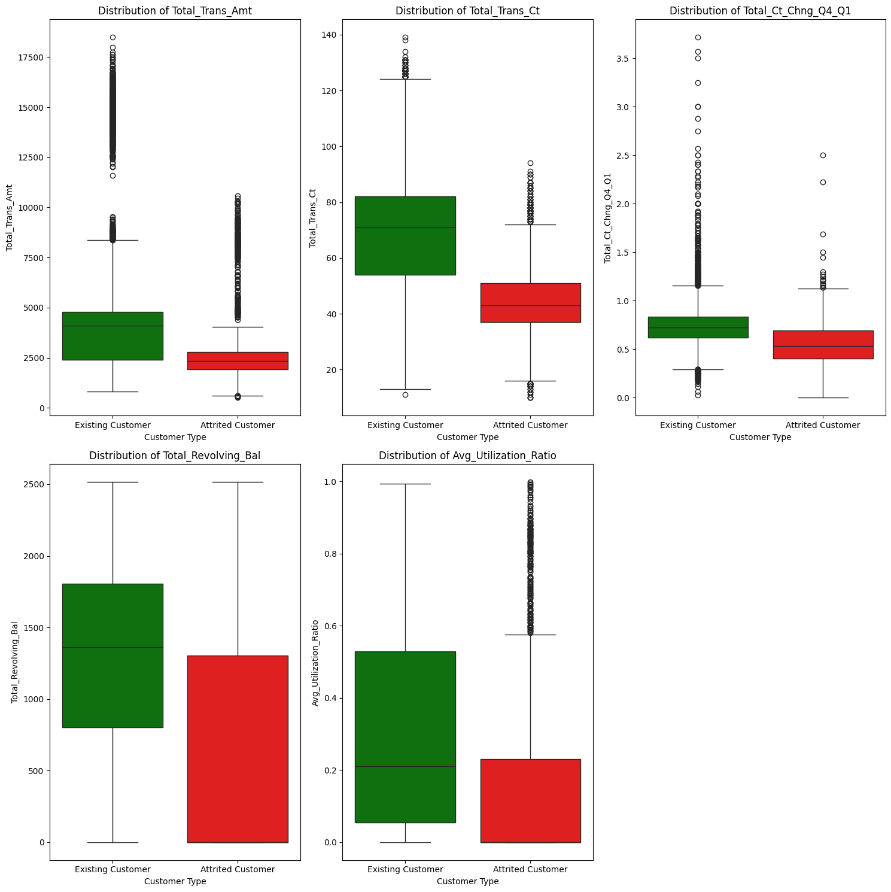

   # Credit Card Churn

   ## Project Overview

   This project focuses on predicting client churn for a financial institution concerned with increasing client retention among credit card holders.  The objective is to analyze clients with more propensity to close their bank accoun, find possible groups of clients and define their characteristics and identify clusters of clients for targeted marketing strategies.

   ## 🛎️ Usage
   To run this project, you will need to install several Python libraries. It is recommended to use a virtual environment. 
   To run the analysis and view the churn prediction models, execute the script on notebooks. 
   Output : bank_churner_prediction.csv

   ## Visuals

   
   
   

               precision    recall  f1-score   support

            0       0.87      0.87      0.87      1304
            1       0.98      0.98      0.98      6798

      accuracy                           0.96      8102
      macro avg      0.92      0.92      0.92      8102
      weighted avg   0.96      0.96      0.96      8102

   **Results after optimize parameter for Random forst:** 
   Best Score: 0.947 
   Precision: 0.945 
   Recall: 0.946 
   F1-score: 0.945 
   Confusion Matrix: 
   [[1039  265] 
   [ 170 6628]] 

   **Results after optimize parameter for XGB Model:** 
   Best Score: 0.958 
   Precision: 0.959 
   Recall: 0.959 
   F1-score: 0.959 
   Confusion Matrix: 
   [[1141  163] 
   [ 166 6632]]

   ## Timeline

   This project was completed in 5 days.

   ## 📌 Personal Situation
   This project was done as part of the AI Boocamp at BeCode.org. 

   Connect with me on [LinkedIn](https://www.linkedin.com/in/soha-mohamad-382b44219/).